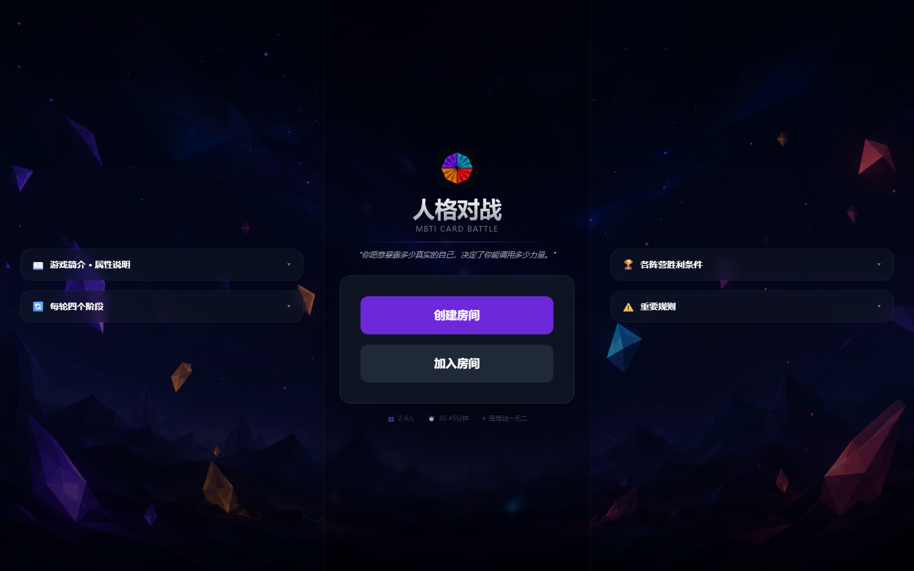
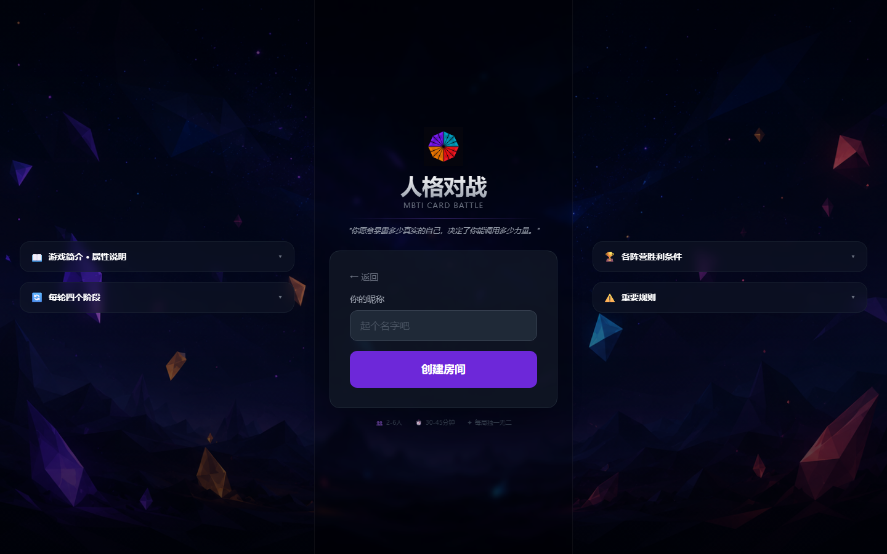
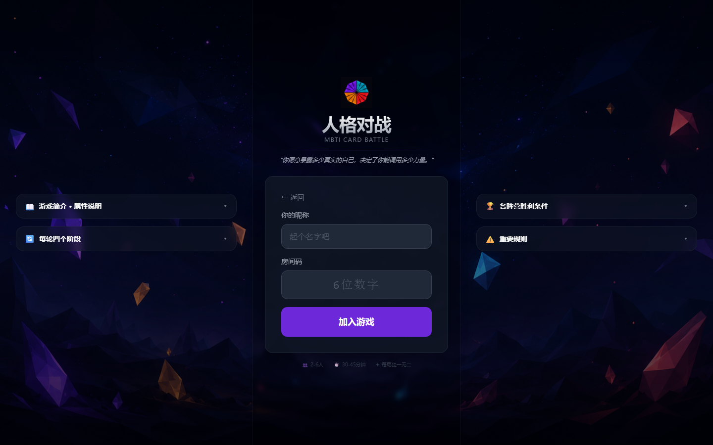
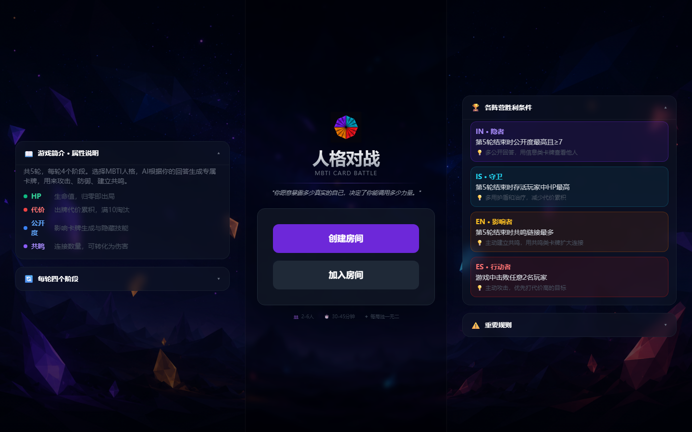
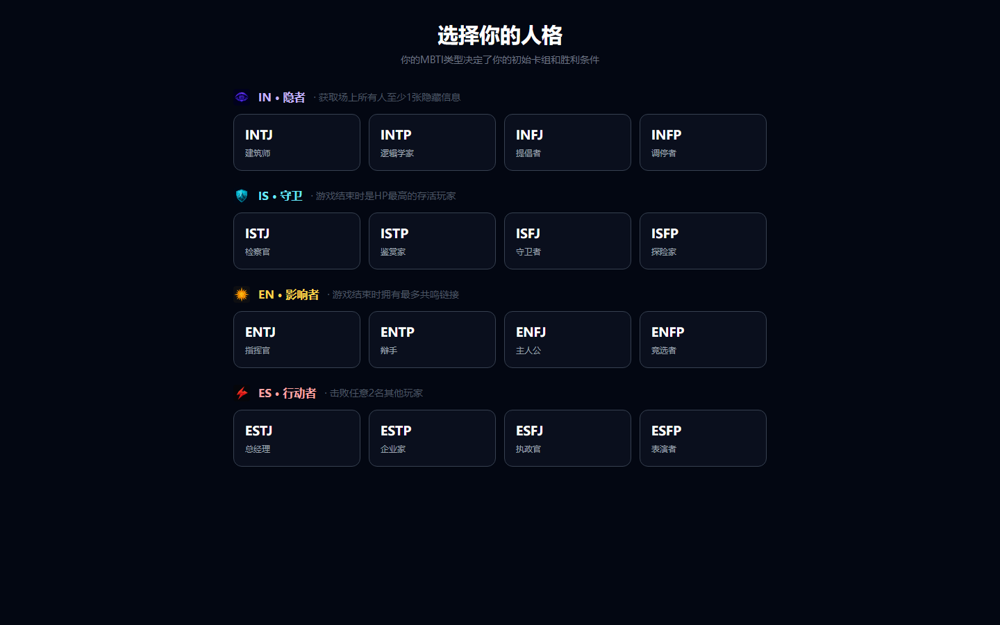
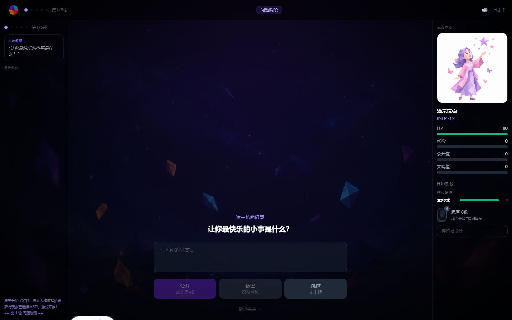

# 人格对战卡牌游戏 · MBTI Card Battle

> 一款 4-6 人在线人格博弈卡牌游戏 —— **你愿意暴露多少真实的自己，决定了你能调用多少力量。**

48 小时黑客松项目。把 MBTI 人格、心理学问答、AI 卡牌生成和多人卡牌对战编织成一种全新的社交游戏体验。

---

## 目录

- [游戏截图](#游戏截图)
- [项目简介](#项目简介)
- [核心玩法](#核心玩法)
- [技术栈](#技术栈)
- [项目结构](#项目结构)
- [快速开始](#快速开始)
- [环境变量](#环境变量)
- [数据库准备（Supabase）](#数据库准备supabase)
- [资源生成脚本](#资源生成脚本)
- [核心数据与逻辑文件](#核心数据与逻辑文件)
- [部署](#部署)
- [演示文稿](#演示文稿)
- [已知注意事项](#已知注意事项)

---

## 游戏截图

| 首页 · 创建/加入房间 | 创建房间 | 加入房间 |
|---|---|---|
|  |  |  |

首页左右两侧的折叠面板展示了游戏的资源说明、每轮阶段、各阵营胜利条件和重要规则：



| 选择 MBTI 人格 | 对战界面 |
|---|---|
|  |  |

---

## 项目简介

游戏不是让玩家扮演一个角色，而是把**玩家自己**转译成角色：

- 选择自己的真实 MBTI 类型，获得对应的基础卡组
- 每轮回答一个心理学问题，回答得越真实/越公开，解锁的卡牌越强
- 第 5 轮的深层回答会由 AI 实时生成一张**专属隐藏技能卡**，全场唯一
- 与其他玩家「共鸣」可以建立链接，但链接双方会共享伤害反噬

最终游戏不是单纯比拼输赢，而是让玩家在策略和真诚之间反复抉择，体验"被看见"。

详细规则见 [docs/01-游戏设计文档.md](docs/01-游戏设计文档.md)。

---

## 核心玩法

### 四大人格阵营（按 MBTI 前两位字母分组）

| 组别 | 包含类型 | 身份 | 玩法风格 | 胜利条件 |
|------|---------|------|---------|---------|
| **IN** 隐者 | INTJ / INTP / INFJ / INFP | 信息控制、长线预判 | 低公开度 | 获取场上所有人至少一份隐藏信息 |
| **IS** 守卫 | ISTJ / ISTP / ISFJ / ISFP | 防守积累、精准等待 | 低公开度 | 游戏结束时 HP 最高的存活玩家 |
| **EN** 影响者 | ENTJ / ENTP / ENFJ / ENFP | 共鸣操控、广域影响 | 高公开度 | 游戏结束时拥有最多共鸣链接 |
| **ES** 行动者 | ESTJ / ESTP / ESFJ / ESFP | 直接打击、即时爆发 | 高公开度 | 击败任意 2 名其他玩家 |

### 四维资源系统

| 资源 | 范围 | 说明 |
|------|------|------|
| 生命值 HP | 0-10 | 归零淘汰 |
| 代价槽 Cost | 0-10 | 满 10 人格失衡，淘汰 |
| 公开度 Exposure | 0-10 | ≥7 才能使用隐藏技能牌 |
| 共鸣值 Resonance | 0-∞ | 与他人产生共鸣链接，伤害有 50% 反噬 |

### 单轮流程（共 5 轮）

```
问题阶段 → 共鸣阶段 → AI卡牌生成阶段 → 战斗阶段 → 结算
```

- 第 1-2 轮（破冰层）→ 生成普通卡
- 第 3-4 轮（展开层）→ 生成稀有卡
- 第 5 轮（深层）→ 生成**隐藏技能卡**（公开度≥7才能激活）

回答方式影响卡牌强度：

| 回答方式 | 卡牌强度 | 共鸣机会 | 公开度变化 |
|---------|---------|---------|-----------|
| 公开回答 | 100% | 有 | +2 |
| 私密回答 | 60% | 无 | +0 |
| 跳过 | 无卡牌 | 无 | +0 |

---

## 技术栈

| 类别 | 选择 |
|------|------|
| 框架 | Next.js 14（App Router）+ TypeScript |
| 数据库 / 实时同步 | Supabase（Postgres + Realtime） |
| AI 卡牌生成 | DeepSeek Chat API（`lib/deepseek.ts`） |
| 样式 | Tailwind CSS |
| 动画 | Framer Motion |
| 部署 | Vercel |

> 注：早期设计文档（`docs/02-开发简报.md`、`docs/04-AI-Prompts.md`）中提到的 AI 方案是 Anthropic Claude API，目前实现已切换为 **DeepSeek**（见 `lib/deepseek.ts`），环境变量为 `DEEPSEEK_API_KEY`。

---

## 项目结构

```
.
├── app/
│   ├── page.tsx                          # 首页：创建/加入房间
│   ├── room/[roomCode]/
│   │   ├── lobby/page.tsx                # 等待房间
│   │   ├── setup/page.tsx                # 选择 MBTI、获得基础卡组
│   │   ├── play/page.tsx                 # 主游戏界面（问答/共鸣/出牌）
│   │   └── result/page.tsx               # 结局页 / 人格映射卡
│   └── api/
│       ├── room/create/route.ts          # 创建房间
│       ├── room/join/route.ts            # 加入房间
│       ├── game/setup/route.ts           # 提交 MBTI / 完成准备
│       ├── game/start/route.ts           # 房主开始游戏
│       ├── game/force-start/route.ts     # 强制开局（人数不足时）
│       ├── game/answer/route.ts          # 提交问题回答
│       ├── game/resonate/route.ts        # 共鸣投票（"我也是"）
│       ├── game/play-card/route.ts       # 出牌、效果结算
│       ├── game/advance-phase/route.ts   # 阶段推进
│       ├── game/end-turn/route.ts        # 结束当前回合
│       └── ai/
│           ├── generate-card/route.ts        # AI 生成普通/稀有卡
│           └── generate-hidden-skill/route.ts# AI 生成隐藏技能卡
├── components/
│   ├── CardComponent.tsx                 # 卡牌组件
│   └── PlayerStatus.tsx                  # 玩家状态面板
├── lib/
│   ├── types.ts                          # 全局类型定义（GameState/Player/Card等）
│   ├── cards.ts                          # 56 张预设卡牌数据
│   ├── fallbackCards.ts                  # AI 生成失败时的兜底卡牌
│   ├── questions.ts                      # 5 轮问题池
│   ├── gameLogic.ts                      # 核心游戏流程（阶段推进/胜负判定等）
│   ├── cardEffects.ts                    # 卡牌效果执行器
│   ├── deepseek.ts                       # DeepSeek API 调用封装
│   ├── sounds.ts                         # 音效
│   └── supabase.ts                       # Supabase 客户端
├── public/
│   ├── card-art/                         # 卡牌美术（按 MBTI 类型 + 通用类型）
│   └── board-*.png                       # 棋盘/背景美术
├── scripts/
│   ├── generate-assets.js                # 批量生成美术资源
│   ├── generate-card-art.js              # 生成全部卡牌插画
│   └── generate-sprites.js               # 生成精灵图
├── docs/
│   ├── 00-README.md                      # 黑客松交付清单 / Demo 脚本
│   ├── 01-游戏设计文档.md                  # 完整游戏规则
│   ├── 02-开发简报.md                     # 技术架构（原始设计）
│   ├── 04-AI-Prompts.md                  # AI Prompt 设计
│   ├── 16型人格卡牌设计.md                 # 16型专属卡牌设计
│   └── presentation.html                 # 项目介绍 PPT（浏览器打开）
└── 03-cards.ts                           # 卡牌数据源文件（导入到 lib/cards.ts）
```

---

## 快速开始

### 前置要求

- Node.js 18+
- 一个 Supabase 项目
- 一个 DeepSeek API Key

### 安装依赖

```bash
npm install
```

### 配置环境变量

复制 `.env.local.example` 为 `.env.local`，并填入真实值：

```bash
cp .env.local.example .env.local
```

### 启动开发服务器

```bash
npm run dev
```

打开 [http://localhost:3000](http://localhost:3000)。

### 其他脚本

```bash
npm run build   # 生产构建
npm run start   # 启动生产服务器
npm run lint    # ESLint 检查
```

---

## 环境变量

在 `.env.local` 中配置（参考 `.env.local.example`）：

```env
NEXT_PUBLIC_SUPABASE_URL=https://your-project.supabase.co
NEXT_PUBLIC_SUPABASE_ANON_KEY=your-anon-key
SUPABASE_SERVICE_ROLE_KEY=your-service-role-key
DEEPSEEK_API_KEY=sk-your-deepseek-key
```

| 变量 | 用途 |
|------|------|
| `NEXT_PUBLIC_SUPABASE_URL` | Supabase 项目地址，客户端可见 |
| `NEXT_PUBLIC_SUPABASE_ANON_KEY` | Supabase 匿名 Key，用于客户端 Realtime 订阅 |
| `SUPABASE_SERVICE_ROLE_KEY` | 服务端写操作使用，**切勿暴露到客户端** |
| `DEEPSEEK_API_KEY` | 调用 DeepSeek 生成卡牌内容 |

---

## 数据库准备（Supabase）

1. 在 Supabase 创建新项目
2. 在 SQL Editor 中创建 `game_rooms` 表（结构详见 [docs/02-开发简报.md](docs/02-开发简报.md) 第三节）
3. 启用 Realtime：

```sql
ALTER PUBLICATION supabase_realtime ADD TABLE game_rooms;
```

4. 开发期建议**关闭 RLS**（Row Level Security），避免权限问题；正式上线前再开启并配置策略

> 所有状态变更均通过服务端 API（`app/api/**`）完成，客户端只通过 Supabase Realtime 订阅只读。

---

## 资源生成脚本

`scripts/` 下提供了基于 AI 图像生成的美术资源批处理脚本：

```bash
npm run gen-assets       # 生成全部美术资源
npm run gen-characters   # 仅生成 16 种人格的角色立绘
npm run gen-ui           # 生成 UI 元素（logo、卡背、背景、阵营徽记等）
npm run gen-card-art     # 生成卡牌插画（按类型分类）
npm run gen-all-cards    # 生成全部卡牌美术
npm run gen-sprites      # 生成精灵图
```

> 运行前请检查脚本内的 API Key / 模型配置。

---

## 核心数据与逻辑文件

- **`lib/cards.ts`**：56 张预设卡牌（基础卡 + 16型专属卡），按 [docs/16型人格卡牌设计.md](docs/16型人格卡牌设计.md) 设计
- **`lib/questions.ts`**：5 轮问题池（破冰层 / 展开层 / 深层）
- **`lib/gameLogic.ts`**：阶段推进 (`advancePhase`)、出牌校验 (`canPlayCard`)、胜负判定 (`checkWinConditions`)
- **`lib/cardEffects.ts`**：每张卡 `effect_code` 对应的效果执行函数
- **`lib/fallbackCards.ts`**：当 AI 返回内容解析失败时的兜底卡牌，确保游戏不会卡住
- **`app/api/ai/generate-card/route.ts`**：根据玩家回答生成普通/稀有卡
- **`app/api/ai/generate-hidden-skill/route.ts`**：第 5 轮生成专属隐藏技能卡

---

## 部署

推荐部署到 [Vercel](https://vercel.com)：

1. 关联 GitHub 仓库
2. 在 Vercel 项目设置中配置上述环境变量
3. 部署后在 Supabase 中确认 Realtime 已对生产环境开放

---

## 演示文稿

项目介绍 PPT 位于 [docs/presentation.html](docs/presentation.html)，用浏览器直接打开即可播放：

- `←` / `→` 或空格键翻页
- 右侧圆点可跳转到指定页
- 支持移动端触摸滑动

---

## 已知注意事项

- AI 生成卡必须有 fallback，绝不能让游戏卡住（见 `lib/fallbackCards.ts`）
- 所有状态变更走服务端 API，客户端不要直接修改 `game_rooms` 表
- 开发期 RLS 关闭，上线前需重新开启并配置策略
- 当前仅适配桌面端浏览器，未做移动端适配
